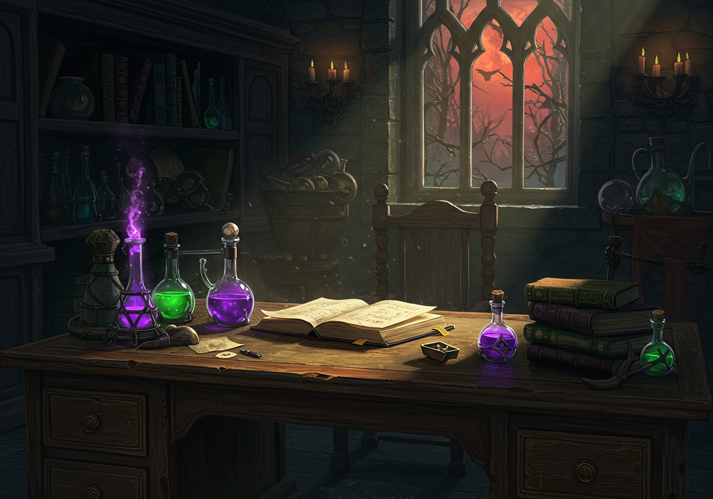

# Perfect Potion 🧪✨

Bem-vindo ao **Perfect Potion** - Um jogo de alquimia onde você coleta ingredientes mágicos e combina-os para criar poções poderosas! Desenvolvido com Python e Pygame.

[](https://www.python.org/downloads/)
[](https://www.pygame.org/)



## 🎮 Sobre o Jogo

No mundo mágico de **Perfect Potion**, você assume o papel de um alquimista aprendiz que deve coletar ingredientes na ordem correta para criar poções mágicas. Cada nível apresenta uma receita única que deve ser seguida à risca. Cuidado! Coletar os itens fora de ordem pode resultar em poções explosivas e prejudicar sua jornada.

### Objetivo
- Colete ingredientes na ordem correta para completar as receitas de poções
- Avance por níveis cada vez mais desafiadores
- Alcance a maior pontuação possível e entre no ranking dos melhores alquimistas

### Características Principais

- 🔮 Sistema de níveis progressivos com dificuldade crescente
- 🎯 Mecânica de combos para pontuação máxima
- 🎵 Trilha sonora imersiva e efeitos sonoros
- 📊 Sistema de ranking para competir com outros jogadores
- 🎨 Gráficos coloridos e efeitos visuais impressionantes
- 🎮 Controles simples e intuitivos

## 🛠️ Como Jogar

## 🚀 Como Jogar

### 🎮 Controles
- **Setas** ou **WASD**: Movimentação do personagem
- **Espaço** ou **Clique Esquerdo**: Atirar poções
- **ESC**: Pausar o jogo/Voltar ao menu
- **R**: Reiniciar o jogo (na tela de game over)

### 📋 Requisitos do Sistema
- Python 3.8 ou superior
- Pygame 2.6.1
- 2GB de RAM
- Placa de vídeo compatível com OpenGL

### 🛠️ Instalação

1. **Clone o repositório**:
   ```bash
   git clone https://github.com/m1ttes1/perfect-potion-game.git
   cd perfect-potion-game
   ```

2. **Instale as dependências**:
   ```bash
   pip install -r requirements.txt
   ```

3. **Execute o jogo**:
   ```bash
   python main.py
   ```

### 🎮 Controles
- **Setas** ou **WASD**: Movimentação do personagem
- **Espaço** ou **Clique Esquerdo**: Atirar poções
- **ESC**: Pausar o jogo/Voltar ao menu
- **R**: Reiniciar o jogo (na tela de game over)

## 🏆 Sistema de Pontuação

- **Acertos em sequência**: Aumenta o multiplicador de pontos
- **Itens raros**: Valem mais pontos
- **Níveis completos**: Bônus de pontos baseado no tempo
- **Destaque no ranking**: Seja o melhor alquimista!

## 🎨 Desenvolvimento

Este jogo foi desenvolvido como parte de um trabalho acadêmico para a UNINTER, utilizando Python e Pygame. O código está organizado de forma modular para facilitar a manutenção e expansão.

## 🏆 Sistema de Pontuação

- **Acertos em sequência**: Aumenta o multiplicador de pontos
- **Itens raros**: Valem mais pontos
- **Níveis completos**: Bônus de pontos baseado no tempo
- **Destaque no ranking**: Seja o melhor alquimista!

## 🖥️ Estrutura do Projeto

```
perfect-potion-game/
├── assets/              # Recursos do jogo (imagens, sons, fontes)
├── src/                 # Código-fonte do jogo
│   ├── data/            # Configurações e banco de dados
│   ├── items/           # Itens do jogo (ingredientes, poções, bombas)
│   ├── menu/            # Telas do jogo (menu, ranking, etc)
│   ├── utils/           # Utilitários e ferramentas
│   ├── database.py      # Gerenciamento do banco de dados
│   ├── game.py          # Classe principal do jogo
│   ├── player.py        # Classe do jogador
│   └── settings.py      # Configurações do jogo
├── .gitignore
├── main.py              # Ponto de entrada do jogo
├── README.md            # Este arquivo
└── requirements.txt     # Dependências do projeto
```

## 👥 Créditos

**Aluno:** Victor Mittestainer  
**RU:** 3655738  
**Curso:** Análise e Desenvolvimento de Sistemas - UNINTER  
**Disciplina:**  Linguagem de Programação Aplicada

Desenvolvido como trabalho prático para a UNINTER.

## 📄 Licença

Este projeto está licenciado sob a licença MIT - veja o arquivo [LICENSE](LICENSE) para detalhes.

---

🎮 Divirta-se jogando **Perfect Potion**! Se encontrar algum bug ou tiver sugestões, sinta-se à vontade para abrir uma [issue](https://github.com/m1ttes1/perfect-potion-game/issues) no repositório. 🚀

